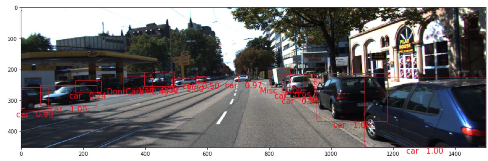
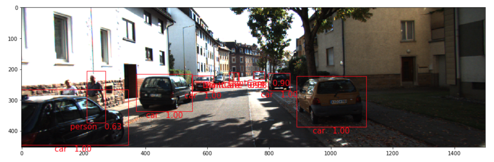
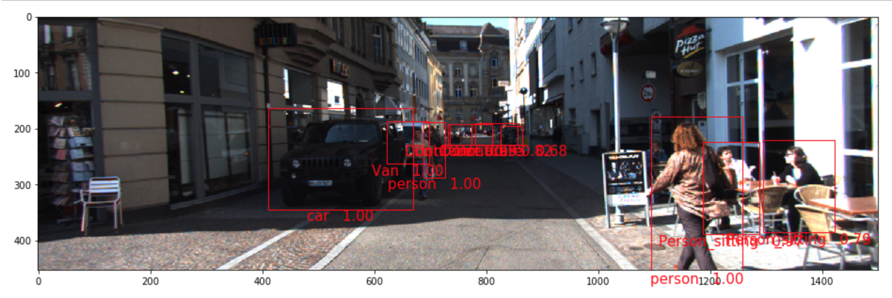

# Residual Networks for Vehicle Detection

This project is a Keras implementation of Faster-RCNN. It can use VGG16, ResNet-50, or ResNet-101 as the base architecture. It has been trained on the PASCAL VOC 2007/2012 object detection image sets, as well as the KITTI 2D object detection set for self-driving vehicles.

## Video Demo

[](https://www.youtube.com/watch?v=OrxENIKjaOI)

## Sample Outputs





## Getting Started

You will need Conda and Python 3.5 to install this project. Clone the repo and create a conda environment using the environment.yml file. On MacOS:

```
conda env create -f environment.yml
```

On Linux:

```
conda env create -f environment.ec2.yml
```

Activate the environment:

```
source activate faster_rcnn
```

Download [ResNet-101 weights](https://gist.github.com/flyyufelix/65018873f8cb2bbe95f429c474aa1294) to models/resnet101_weights_tf.h5 if it's not already there.

## Acquiring Training/Test Data
### PASCAL VOC Data
Download the [PASCAL VOC](http://host.robots.ox.ac.uk/pascal/VOC/) training set. To evaluate trained models' performance, you will also need the test set.

### KITTI Data
Download the [KITTI 2D Object Detection](http://www.cvlibs.net/datasets/kitti/eval_object.php) training set.

Then convert the dataset to the PASCAL VOC format by using the [VOD Converter](https://github.com/umautobots/vod-converter). There are no annotations for the test set so you will have to split the training set into a smaller training set and validation set. Do so by creating your own train.txt and val.txt in ImageSets/Main under the root data directory.

## Training Models
### PASCAL VOC
Models are trained in 4 steps. With the conda environment activated, the following example shows how to train a PASCAL VOC model on the 2007/2012 trainval set.

```
python faster_rcnn/train_rpn_step1.py --voc_paths $VOC_ROOT/VOC2007/,$VOC_ROOT/VOC2012/ --phases 60000:1e-3,20000:1e-4 --optimizer sgd --img_set trainval --network resnet50 --anchor_scales 128,256,512 --resize_dims 600,1000 --save_weights_dest models/rpn_weights_r50_fullreg_step1_voc20072012_trainval.h5 --save_model_dest models/rpn_model_r50_fullreg_step1_voc20072012_trainval.h5 2>&1 | tee train_r50_rpn_step1_tmp
```
```
python faster_rcnn/train_det_step2.py models/rpn_weights_r50_fullreg_step1_voc20072012_trainval.h5 --voc_paths $VOC_ROOT/VOC2007/,$VOC_ROOT/VOC2012/ --phases 60000:1e-3,20000:1e-4 --optimizer sgd --img_set trainval --network resnet50 --anchor_scales 128,256,512 --resize_dims 600,1000 --save_weights_dest models/detector_weights_r50_fullreg_step2_voc20072012_trainval.h5 --save_model_dest models/detector_model_r50_fullreg_step2_voc20072012_trainval.h5 2>&1 | tee train_r50_det_step2_tmp
```
```
python faster_rcnn/train_rpn_step3.py --step2_weights_path models/detector_weights_r50_fullreg_step2_voc20072012_trainval.h5 --voc_paths $VOC_ROOT/VOC2007/,$VOC_ROOT/VOC2012/ --phases 60000:1e-3,20000:1e-4 --optimizer sgd --img_set trainval --network resnet50 --anchor_scales 128,256,512 --resize_dims 600,1000 --save_weights_dest models/rpn_weights_r50_fullreg_step3_voc20072012_trainval.h5 --save_model_dest models/rpn_model_r50_fullreg_step3_voc20072012_trainval.h5 2>&1 | tee train_r50_rpn_step3_tmp
```
```
python faster_rcnn/train_det_step4.py models/rpn_weights_r50_fullreg_step3_voc20072012_trainval.h5 --voc_paths $VOC_ROOT/VOC2007/,$VOC_ROOT/VOC2012/ --phases 60000:1e-3,20000:1e-4 --optimizer sgd --img_set trainval --network resnet50 --anchor_scales 128,256,512 --resize_dims 600,1000 --save_weights_dest models/detector_weights_r50_fullreg_step4_voc20072012_trainval.h5 --save_model_dest models/detector_model_r50_fullreg_step4_voc20072012_trainval.h5 --save_rpn_model_dest models/rpn_model_r50_fullreg_step3_voc20072012_trainval.h5 2>&1 | tee train_r50_det_step4_tmp
```

### KITTI
To train KITTI models, an extra --kitti argument is needed to use the right object classes.

```
python faster_rcnn/train_rpn_step1.py --voc_paths $KITTI_ROOT --phases 60000:1e-3,20000:1e-4 --optimizer sgd --img_set train --network resnet50 --anchor_scales 16,32,64,128,256,512 --resize_dims 600,1500 --save_weights_dest models/rpn_weights_r50_fullreg_step1_kitti_train.h5 --save_model_dest models/rpn_model_r50_fullreg_step1_kitti_train.h5 2>&1 | tee train_r50_rpn_step1_tmp
```
```
python faster_rcnn/train_det_step2.py models/rpn_weights_r50_fullreg_step1_kitti_train.h5 --voc_paths $KITTI_ROOT --kitti --phases 60000:1e-3,20000:1e-4 --optimizer sgd --img_set train --network resnet50 --anchor_scales 16,32,64,128,256,512 --resize_dims 600,1500 --save_weights_dest models/detector_weights_r50_fullreg_step2_kitti_train.h5 --save_model_dest models/detector_model_r50_fullreg_step2_kitti_train.h5 2>&1 | tee train_r50_det_step2_tmp
```
```
python faster_rcnn/train_rpn_step3.py --step2_weights_path models/detector_weights_r50_fullreg_step2_kitti_train.h5 --voc_paths $KITTI_ROOT --phases 60000:1e-3,20000:1e-4 --optimizer sgd --img_set train --network resnet50 --anchor_scales 16,32,64,128,256,512 --resize_dims 600,1500 --save_weights_dest models/rpn_weights_r50_fullreg_step3_kitti_train.h5 --save_model_dest models/rpn_model_r50_fullreg_step3_kitti_train.h5 2>&1 | tee train_r50_rpn_step3_tmp
```
```
python faster_rcnn/train_det_step4.py models/rpn_weights_r50_fullreg_step3_kitti_train.h5 --voc_paths $KITTI_ROOT --kitti --phases 60000:1e-3,20000:1e-4 --optimizer sgd --img_set train --network resnet50 --anchor_scales 16,32,64,128,256,512 --resize_dims 600,1500 --save_weights_dest models/detector_weights_r50_fullreg_step4_kitti_train.h5 --save_model_dest models/detector_model_r50_fullreg_step4_kitti_train.h5 --save_rpn_model_dest models/rpn_model_r50_fullreg_step3_kitti_train.h5 2>&1 | tee train_r50_det_step4_tmp
```

## Evaluating Trained Models

### PASCAL VOC

To make predictions:

```
python faster_rcnn/voc_dets.py models/voc_r50_fullreg_trainval/rpn_model_r50_fullreg_step3_voc20072012_trainval.h5 models/voc_r50_fullreg_trainval/detector_model_r50_fullreg_step4_voc20072012_trainval.h5 --voc_path $VOC_TEST_ROOT/VOC2007/ --det_threshold 0.0 --resize_dims 600,1000 --img_set test --network resnet50 --out_dir ./tmpout/ 2>&1 | tee test_r50_det_tmp
```

To evaluate predictions against ground truth data:

```
python faster_rcnn/eval_dets.py --dets_path ./tmpout --voc_path $VOC_TEST_ROOT/VOC2007/ --img_set test
```

### KITTI

To make predictions:

```
python faster_rcnn/voc_dets.py models/kitti_r50_fullreg_train/rpn_model_r50_fullreg_step3_kitti_train.h5 models/kitti_r50_fullreg_train/detector_model_r50_fullreg_step4_kitti_train.h5 --voc_path $KITTI_ROOT --kitti --det_threshold 0.0 --resize_dims 600,1500 --anchor_scales 16,32,64,128,256,512 --img_set val --network resnet50 --out_dir ./tmpout/ 2>&1 | tee test_r50_det_tmp
```

To evaluate predictions against ground truth data:

```
python faster_rcnn/eval_dets.py --dets_path ./tmpout --voc_path $KITTI_ROOT --kitti --img_set val
```